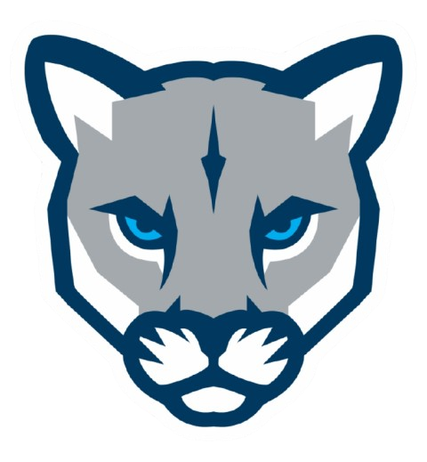

# 💫 About Me:
Hi, I'm Aden  Currently learning Python, and SQL First year Computer Science student at MRU  Native English, Intermediate Español, Elementary Українська + Русский + 日本語. 

## 🌐 Socials:
   

# 💻 Tech Stack:
              
# 📊 GitHub Stats:
 
 

## 🏆 GitHub Trophies

<!-- Proudly created with GPRM ( https://gprm.itsvg.in ) -->
